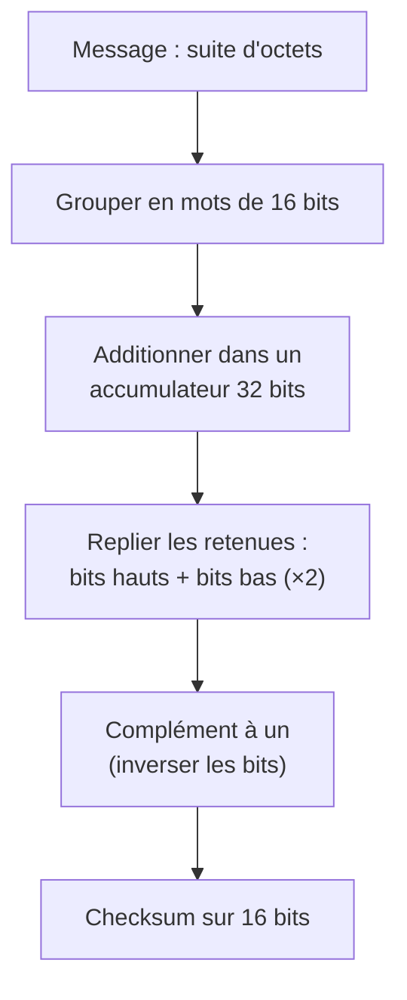
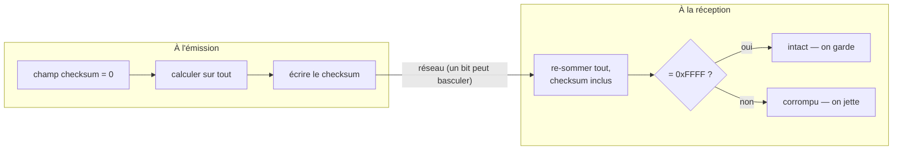

# Une somme contre le bruit

Le paquet du chapitre précédent était presque complet — un en-tête, un payload —
mais il lui manquait un champ, laissé à zéro : la **somme de contrôle**. Sans elle,
aucune machine, à l'autre bout, ne le reconnaîtrait comme valide. Ce chapitre la
calcule. Et pour y arriver proprement, il a d'abord fallu régler une vieille
querelle : dans quel ordre range-t-on les octets d'un nombre ?

## Détecter une erreur qu'on ne voit pas

Un paquet traverse des câbles, des routeurs, parfois les ondes. En chemin, un bit
peut basculer — bruit électrique, interférence. Le destinataire reçoit une suite
d'octets : **comment sait-il qu'elle est intacte ?** L'émetteur calcule une petite
**empreinte** du contenu et la joint au paquet ; le destinataire la recalcule et
compare. Si elles diffèrent, un octet a changé en route, et le paquet est jeté. Ce
n'est *pas* de la sécurité — un intrus pourrait refaire l'empreinte — mais un filet
contre les erreurs *accidentelles*, celles du monde physique.

## Par quel bout casser l'octet

Cette empreinte est un nombre de deux octets, et là surgit la vieille querelle. Un
nombre comme `0x1234` occupe deux cases mémoire : faut-il écrire `0x12` (le « gros
bout ») en premier, ou `0x34` (le « petit bout ») ? Les deux écoles existent :

- **gros-boutiste** (*big-endian*) : le poids fort d'abord, `0x1234` → `[12, 34]` —
  l'ordre naturel, comme on écrit les nombres ;
- **petit-boutiste** (*little-endian*) : le poids faible d'abord, `0x1234` →
  `[34, 12]` — celui de nos processeurs x86.

Le nom vient d'une satire : dans *Les Voyages de Gulliver*, deux factions se font la
guerre pour savoir par quel bout casser un œuf. Les informaticiens ont repris
l'image parce que le choix est, au fond, tout aussi **arbitraire** — aucun n'est
meilleur, ils sont juste incompatibles. Tant qu'un programme reste chez lui, cela
ne se voit pas. Mais dès que **deux machines s'échangent des octets**, si l'une écrit
`[34, 12]` et que l'autre lit « à sa façon », elle comprend `0x3412`. Le dialogue est
rompu.

Les protocoles Internet tranchent par décret : **sur le fil, tout nombre est en
gros-boutiste** — le *network byte order*. Chaque machine convertit avant d'émettre,
reconvertit à la réception. La fonction `htons` est ce traducteur, et sa beauté est
de s'adapter : sur une machine gros-boutiste elle ne fait **rien**, sur nos x86 elle
**inverse** les deux octets. Le code écrit avec `htons` est donc portable sans une
ligne de plus — c'est pourquoi l'identifiant, la séquence, et maintenant le
checksum, y passent tous.

## L'algorithme : additionner, replier, inverser

Le calcul lui-même (défini par la RFC 1071) tient en trois gestes.

**Additionner** — on groupe les octets en mots de 16 bits et on les additionne
tous. Mais une somme binaire ordinaire *perd* ce qui déborde : `0xFFFF + 0x0001`
tronqué à 16 bits fait `0x0000`, et deux paquets différents auraient la même
empreinte. On utilise donc l'**arithmétique en complément à un**, où la retenue
n'est pas jetée mais **réinjectée** dans les bits de poids faible — le *repli des
retenues*. En pratique : additionner dans un accumulateur large, puis replier les
bits hauts sur les bits bas (deux fois suffisent).

**Inverser** — le checksum stocké est le *complément* de cette somme (tous ses bits
retournés). Pourquoi cette inversion ? Pour une raison élégante, révélée à la
vérification.

**L'octet impair** — si le message a un nombre impair d'octets, le dernier n'a pas de
partenaire : on le complète d'un octet nul, à sa droite, et il devient le poids fort
d'un ultime mot.



## Un exemple chiffré

Prenons l'en-tête `08 00 00 00 12 34 00 01`. Ses mots s'additionnent en `0x1A35`,
qui tient sur 16 bits — pas de repli. Le complément `~0x1A35` donne **`0xE5CA`**,
exactement ce qu'affiche un analyseur réseau.

Ajoutons-lui le payload `DE AD BE EF`. Cette fois la somme déborde :
```
  0x1A35 + 0xDEAD + 0xBEEF = 0x1B7D1     <- le bit 16 est à 1
```
On replie : `0x0001 + 0xB7D1 = 0xB7D2`. Complément : `~0xB7D2 = 0x482D`. C'est la
valeur qui remplace enfin les `00 00` du chapitre précédent — mon paquet est
désormais valide sur le fil.

## Vérifier, c'est re-sommer

Voici la raison de l'inversion. Le destinataire re-additionne **tout, checksum
compris** — c'est-à-dire `somme + ~somme`. Or un nombre plus son complément, ce sont
**tous les bits à 1** : `0xFFFF`, le « zéro négatif » du complément à un. La règle du
récepteur est donc d'une simplicité limpide :



C'est cette même propriété — re-sommer un paquet valide donne zéro — que je
réutiliserai au prochain chapitre pour reconnaître une réponse authentique parmi le
bruit du réseau. Une seule primitive sert aux deux bouts.

## Prouver sans réseau

Comme tout le reste de ce cœur de calcul, la fonction est **pure** : mêmes octets en
entrée, même empreinte en sortie, toujours. Je peux donc la prouver hors ligne, en
la confrontant à des **vecteurs de référence** — dont un tiré de la RFC elle-même et
plusieurs recoupés avec un analyseur de paquets. Et c'est ici que le choix de
calculer *en ordre réseau* paie : ma fonction rend directement la valeur
*canonique* (`0x482D`), celle que la RFC et les outils reconnaissent, plutôt qu'une
valeur mêlée à l'ordre de ma machine. Le *quoi* d'un côté, le *comment le ranger*
de l'autre — et des tests qui parlent la même langue que les références.

## Sources

- [RFC 1071 — Computing the Internet Checksum](https://www.rfc-editor.org/rfc/rfc1071) — l'algorithme, ses propriétés, un vecteur de test
- [RFC 792 — Internet Control Message Protocol](https://www.rfc-editor.org/rfc/rfc792) — le champ checksum de l'ICMP
- Jonathan Swift, *Les Voyages de Gulliver* (1726) — l'origine des « boutistes »
- [byteorder(3) — `htons` et la famille](https://man7.org/linux/man-pages/man3/htons.3.html)
