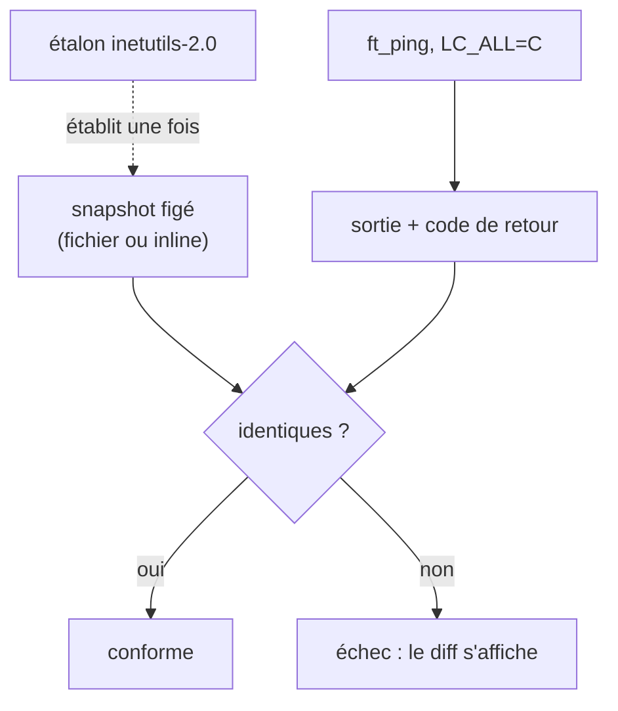

# Au pied de la lettre

L'article précédent s'est arrêté sur un aveu : les 93 tests Criterion vérifient le *code* de sortie et l'*effet* sur le record, jamais le **texte exact** des messages. « option value too big: 65400 », à l'apostrophe près, restait hors de leur portée — et une autre suite, « en boîte noire », devait s'en charger. La voici.

> Comme `test-options`, cet article suit `tests/conformance/` au plus près : il évolue avec lui.

## Deux fenêtres sur le même parseur

On peut éprouver un programme par le dedans ou par le dehors.

- **Criterion** regarde le **dedans** : il appelle `options_parse` en mémoire et inspecte le `t_options` qui en sort. Il connaît la structure interne — c'est une boîte **blanche**. Son terrain : la *logique* (quel bit, quel code).
- Un **harnais shell maison** regarde le **dehors** : il lance le vrai binaire et lit ce qu'il imprime. Il ne sait rien de l'intérieur — c'est une boîte **noire**. Son terrain : la *façade* (le texte, à l'octet).

Les deux ne se recouvrent pas, elles se complètent. La première garantit que le parseur *raisonne* juste ; la seconde, qu'il *parle* juste.

Ce second banc est **fait maison** — un script shell d'à peine cent lignes. Un cadre de test tout prêt (`bats`) aurait dû s'installer en sous-module, or le dépôt de rendu de l'école ne les accepte pas ; du shell ne dépend de rien et tourne partout.

## La référence : l'étalon

« Parler juste », mais par rapport à quoi ? À l'**étalon** : le `ping` de GNU inetutils-2.0, l'original que `ft_ping` réécrit. Le script `install-etalon.sh` (vu au banc d'essai) le compile à l'écart, sous un nom à lui. La sortie correcte de `ft_ping`, c'est celle de l'étalon — à notre identité près (notre nom, notre version, l'adresse où signaler les bugs).

## Figer, plutôt que rejouer

Restait un choix de méthode. Pour comparer à l'étalon, deux voies : le **rejouer** à chaque test (le lancer en direct, à côté de `ft_ping`), ou **figer** une bonne fois sa sortie — un instantané, un *snapshot* — et n'y confronter ensuite que `ft_ping`.

J'ai choisi de figer. Rejouer l'étalon en continu obligerait à l'installer partout, **y compris dans l'intégration continue** — sa compilation, sa vérification GPG, et surtout sa *capability* réseau, fragile dans un conteneur. Et comme nos divergences assumées (le nom, l'adresse des bugs, la version) feraient de toute façon échouer une comparaison brute, il faudrait *encoder l'attendu* malgré tout. Autant le figer franchement : l'étalon sert à **établir** les snapshots une fois ; ensuite, les tests ne dépendent plus que de `ft_ping`.



Les sorties courtes (un message d'erreur) sont figées **dans le test** ; les longues (les écrans d'aide, qui font jusqu'à 45 lignes) dans des fichiers `expected/`, plus lisibles et faciles à régénérer.

## Le piège de la langue

Une surprise a guidé tout le reste. Lancé sur ma machine, `ft_ping -Z` ne répondait pas comme l'étalon, mais **en français** : « option invalide ». La cause : `ft_ping` fait `setlocale(LC_ALL, "")`, donc respecte la langue de l'environnement — et la glibc **traduit alors les messages d'argp**. L'étalon, lui, n'embarque pas ses traductions : il reste anglais.

Un test ne doit pas dépendre de la langue de qui le lance. On **fixe** donc la locale neutre, `LC_ALL=C`, dans laquelle argp repasse à l'anglais et se réaligne sur l'étalon. Détail rassurant : nos *propres* messages (ceux d'`error.c`) sont des littéraux anglais, **jamais traduits** — conformes quelle que soit la langue. Seul argp parlait une autre langue ; `LC_ALL=C` le ramène dans le rang.

## Deux voix, deux guillemets

Une fois la langue fixée, le verdict est net. Tout ce que **notre** code imprime est conforme à l'octet (au nom près) :

```
ft_ping: missing host operand                 ← notre voix : apostrophes droites
Try 'ft_ping --help' or 'ft_ping --usage' …

ft_ping: invalid option -- 'Z'                ← argp : accent grave ouvrant
Try `ft_ping --help' or `ft_ping --usage' …
```

La seconde ligne trahit la seule divergence qui résiste : pour les options **inconnues**, c'est argp — pas nous — qui compose le « Try », et la glibc le cite avec un accent grave (`` ` ``) là où la gnulib de l'étalon met une apostrophe droite. Hors de notre portée, connu, consigné dans le registre des décisions différées. Le snapshot le **fige tel quel** : on assume la divergence en l'écrivant noir sur blanc.

(Un détail de portabilité : argp imprime `argv[0]` **brut** pour ces erreurs — le chemin d'appel. On lance donc le binaire avec `argv[0]` forcé au simple `ft_ping`, pour que l'instantané ne traîne ni `./` ni chemin absolu de CI.)

## Un filet sous les snapshots

Un instantané a un défaut : figé, il peut dériver de la référence sans qu'on le voie. D'où un garde-fou, `generate-snapshots.sh` : il **régénère** les fichiers `expected/` depuis `ft_ping`, puis **reconfronte** toute la surface à l'étalon (nom normalisé), et liste les écarts. Le jour où l'on touche un message, on relance ce script : les seules divergences qui doivent subsister sont les assumées (adresse des bugs, version, accent grave, le `-w -5` qu'on a choisi de refuser autrement). Toute autre est un signal.

## Là où ça se branche

La suite vit derrière la porte unique : `make conformance`, intégrée à `make check`. Sa place s'y justifie — contrairement à `analyze` ou `memcheck`, elle est **rapide** et **sans privilège** (des snapshots, pas d'étalon, pas de socket). Comme le `check` de la CI est déjà la barrière obligatoire des *pull requests*, la conformité devient *required* sans rien changer d'autre.

Un bénéfice tombe dans l'escarcelle au passage : `make check` vient de bâtir `ft_ping` en *debug* sous *sanitizers*, et c'est ce binaire que la conformité exécute. Lancer la douzaine de cas, c'est donc passer le vrai programme **sous ASan** sur tous ses chemins de ligne de commande — précisément ce qu'un ancien marque-page (`run-asan`) attendait. Il a disparu, réalisé par celle-ci.

## Sources

- `tests/conformance/conformance.sh` — le harnais boîte noire en shell pur : aucune dépendance à installer ni vendorer (le dépôt de rendu 42 ne prend pas les sous-modules) ; il lance `ft_ping`, capture sa sortie et la confronte aux instantanés
- inetutils-2.0 (`ping`) — l'étalon dont la sortie établit les snapshots ; installé à l'écart par `tests/install-etalon.sh`
- Les articles `test-options` (« Le parseur passé au crible ») — la boîte blanche que celle-ci complète — et `error-header` (« Dire l'erreur d'une seule voix ») — l'origine des deux guillemets
