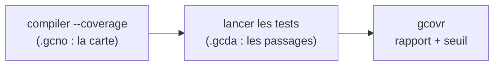

# Compter ses angles morts

Deux familles de tests éprouvent le parseur : Criterion en boîte blanche, le harnais shell en boîte noire. 94 cas, tous verts. Mais une question demeure, sourde : quelle **part** du code ces tests touchent-ils vraiment ? Un test peut passer en n'exécutant qu'une fraction des lignes ; le reste, jamais visité, pourrait cacher n'importe quoi. La **couverture** met un chiffre sur cet angle mort.

## Le principe

Le compilateur sait s'instrumenter lui-même. Compilé avec `--coverage`, chaque module gagne un double comptable : à la compilation, un fichier `.gcno` (la carte des lignes et des branches) ; à l'exécution, un `.gcda` (combien de fois chacune a été franchie). L'outil **`gcovr`** recoupe les deux et produit un rapport : tant de lignes exécutées sur tant, branche par branche, fichier par fichier.

## Un binaire à part, et pourquoi

On pourrait croire qu'il suffit d'ajouter `--coverage` au binaire de test existant. C'est un piège : ce binaire-là est compilé **sous AddressSanitizer**, et ASan **réécrit le flux d'exécution** pour traquer la mémoire — les compteurs de couverture en sortent faussés. La couverture exige donc son **propre binaire**, sans sanitizers, compilé à `-O0` (l'optimisation réorganise le code au point de rendre le comptage illisible). Deux profils, deux objets, deux buts : l'un chasse les bugs mémoire, l'autre mesure. C'est exactement la séparation que le `Makefile` entretenait déjà entre ses profils.

## Le piège du *fork*

Restait une vraie inquiétude. Criterion **isole chaque test dans son propre processus** (un *fork*) — c'est sa force, un *segfault* n'abat pas la suite. Mais alors, chaque fork tient *sa* copie des compteurs : à sa mort, qui écrit le `.gcda` ? Si Criterion tuait ses enfants brutalement, les passages seraient perdus, et la couverture mentirait par défaut.

Vérification faite, ils survivent — à une condition : **`-fprofile-abs-path`**. Comme nos objets vivent hors de l'arbre des sources (`obj/coverage/`), ce drapeau grave dans chaque `.gcno` le chemin **absolu** où déposer son `.gcda`. Chaque fork sait ainsi exactement où écrire, et `gcovr` retrouve tout. Sans ce drapeau, les `.gcda` se perdraient en route.

Un dernier détail, sournois : les compteurs **s'accumulent** d'un run à l'autre (le runtime *ajoute* au `.gcda` existant). Une seconde mesure sans ménage donnerait un score gonflé, voire corrompu. La cible **efface les `.gcda` avant** chaque passage.

## Un garde-fou, pas un absolu

Le rapport tombe : `error.c` **100 %**, `options.c` **94 %**, **95 % des lignes** au total. Les rares lignes manquées sont des branches d'erreur résiduelles — un débordement précis, un cas tordu que la matrice n'a pas piqué.

Faut-il viser 100 % ? Non. Forcer la couverture de ces dernières branches produirait des tests **artificiels**, écrits pour le chiffre et non pour le sens. On pose plutôt un **seuil de garde à 90 %** (`--fail-under-line 90`) : sous ce plancher, `gcovr` rend la main avec une erreur. Il n'exige pas la perfection ; il **attrape une chute franche** — le jour où un pan de code arriverait sans le moindre test. Marge suffisante au-dessus du 95 % réel pour ne pas se déclencher au premier ajout.

## Où ça vit

`make coverage` reste **hors de `check`** : c'est un rapport, pas une barrière (comme `analyze` et `memcheck`). Le HTML détaillé atterrit dans `coverage/` (gitignoré), commodité pour explorer les lignes rouges à la souris. En intégration continue, un **job dédié** publie le rapport et applique le seuil ; il rejoindra les vérifications *obligatoires* à la *pull request* de fin de sprint. C'est aussi ce jalon qui clôt la dernière décision différée du chantier de test : la couverture, longtemps un simple écho dans le `Makefile`, mesure enfin pour de vrai.

## Sources

- `gcovr` ([gcovr.com](https://gcovr.com)) — l'agrégateur : `--filter`/`--exclude`, `--fail-under-line`, `--html-details`, `--cobertura` ; `--gcov-executable` doit s'accorder au compilateur (`gcov-13` ↔ `gcc-13`)
- gcc, *Instrumentation Options* (`--coverage`, `-fprofile-abs-path`) et `man gcov(1)` (l'accumulation des `.gcda`)
- L'article `test-harness` (« Le banc d'essai avant la pièce ») — les profils de build séparés dont la couverture hérite, et `test-options` / `conformance`, les tests qu'elle mesure
