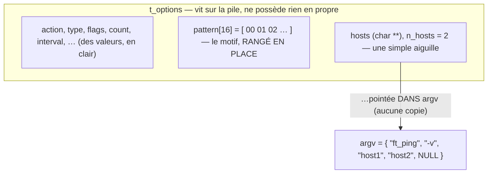

# La carte avant le territoire

Une fois clair *ce que* `ping` doit faire, une autre question se pose : comment *dire* ces choses dans le code ? Avant d'écrire la moindre fonction, j'ai rassemblé dans un seul fichier d'en-tête — `include/ft_ping.h` — le vocabulaire du programme : ses valeurs par défaut, et les types qui structurent tout le reste. Cet article en est la documentation détaillée ; il avance lentement, en s'arrêtant sur chaque choix, car ces décisions-là gouvernent tout le code qui viendra.

> Cet article suit `include/ft_ping.h` au plus près : à chaque évolution du fichier, il est mis à jour dans le même mouvement, pour que la carte ne mente jamais sur le territoire.

## Dire les choses avant de les faire

Un fichier d'en-tête (`.h`) ne contient pas de code qui s'exécute : il **déclare des noms** — des constantes, des formes de données — que les autres fichiers du programme se partagent. Quand `main.c` et `options.c` veulent parler du même `t_options`, ils n'en gardent pas chacun leur version : ils incluent tous deux `ft_ping.h`, et y lisent *la* définition, unique.

Réunir ces déclarations en un point, c'est se donner une **carte avant d'arpenter le territoire** : on fixe d'abord *de quoi on parle*, ensuite seulement *comment on le manipule*. L'intérêt est double. Les décisions de conception sont concentrées là, au lieu d'être éparpillées dans les fichiers source ; et le code qui suit peut rester sobre en commentaires, puisque l'explication de fond — la voici — vit ici, dans cet article.

`ft_ping.h` se lit en deux moitiés : un bloc de **valeurs par défaut**, puis une série de **types**. Prenons-les dans l'ordre.

## Les valeurs héritées

La première moitié fige les réglages que `ft_ping` adopte quand l'utilisateur ne précise rien. Toutes sont reprises de inetutils-2.0, pour un comportement identique au modèle. Mais derrière chaque chiffre se cache un choix de *type* C, et parfois une astuce — examinons-les.

**Les compteurs et les tailles.**

- `COUNT = 0` — le nombre de paquets à envoyer. Son type est `size_t`, l'entier **non signé** que le langage réserve aux tailles et aux comptes : il ne peut pas être négatif, ce qui colle à un nombre de paquets. La valeur `0` est ici un **signal**, pas un compte : elle veut dire *sans fin*, jusqu'à ce qu'on interrompe le programme. C'est le comportement de `ping` lancé sans `-c`.
- `DATALEN = 56` — la taille de la charge utile, en octets ; un `size_t` également. Le chiffre n'est pas arbitraire : `56` octets de données, plus les `8` octets de l'en-tête ICMP, font les **64 octets** ronds qu'affiche n'importe quel `ping`. La constante encode donc « 64 moins l'en-tête ».

**Le rythme et les délais.**

- `INTERVAL = 1000` — le temps d'attente entre deux envois, **en millisecondes**, dans un `size_t` (un entier non signé). C'est la représentation d'inetutils, reprise telle quelle. L'option `-i 0.5` est bien lue en secondes — avec une virgule flottante, le seul endroit où l'on en a besoin — mais aussitôt multipliée par mille et rangée en **millisecondes entières** : le flottant est confiné à la lecture, et tout le reste du programme calcule en entiers, sans les approximations des nombres à virgule. (L'article « Lire un nombre, et s'en méfier » déplie ce choix.)
- `LINGER = 10` — le délai, en secondes (un `int`), qu'on accorde à une réponse avant de la considérer perdue.
- `TIMEOUT = -1` — une échéance globale pour tout le programme. Le `-1` est, là encore, un signal : *aucune* échéance.

**Les sentinelles, et une asymétrie qui surprend.**

Trois réglages — `TOS`, `TTL`, `TIMEOUT` — peuvent être « non demandés ». Comment une simple variable encode-t-elle à la fois une valeur *et* le fait qu'aucune valeur n'a été choisie ? Par une **sentinelle** : une valeur réservée, hors de la plage utile, qui signifie « vide ». C'est pour cela que ces champs sont des `int` **signés** — il leur faut pouvoir descendre sous zéro.

Et c'est ici qu'un détail mérite qu'on s'arrête, parce qu'il pourrait passer pour une incohérence :

```c
#define FT_PING_DEFAULT_TOS (-1)  /* triggers only when >= 0 */
#define FT_PING_DEFAULT_TTL 0     /* 0 means "leave system default" */
```

Pourquoi `TOS` vaut-il `-1` quand `TTL` se contente de `0` ? Parce que la plage *valide* de chacun diffère. Le **TTL** utile commence à `1` (un paquet de TTL nul mourrait sur place) : `0` est donc déjà hors-plage, et fait une sentinelle parfaite — « laisse le système choisir ». Le **TOS**, lui, admet `0` comme valeur tout à fait légitime (c'est même son défaut courant) : on ne peut donc pas s'en servir pour dire « non demandé », et il faut descendre à `-1`, hors de la plage `0..255`. Même intention — « cet octet n'a pas été réglé » — mais deux sentinelles différentes, dictées par ce que chaque champ a le droit de valoir. Le code ne pose ces options sur le réseau que lorsqu'elles franchissent leur seuil (`tos >= 0`, `ttl > 0`).

**Les bornes.**

- `MAX_PATTERN = 16` — la longueur maximale, en octets, du motif de remplissage qu'on peut imposer avec `-p`.
- `MAX_DATALEN = 65399` — la charge utile maximale acceptée par `-s`. Le calcul mérite qu'on l'ouvre : `65535 − 60 − 76`. `65535` est la taille maximale d'un paquet IP (le champ de longueur tient sur 16 bits). On en retranche `60` pour l'en-tête IP et `76` pour l'ICMP. Le point subtil — et c'est pour cela que notre valeur a un jour dû être corrigée — est qu'inetutils ne retranche pas les en-têtes *minimaux* (20 et 8 octets) mais leurs **bornes hautes** (l'en-tête IP peut gonfler jusqu'à 60 octets une fois ses options incluses). Par prudence, il réserve le pire cas. Comme nous voulons que `ft_ping` refuse *exactement* les mêmes tailles que l'étalon, nous reprenons sa valeur plutôt qu'un calcul « plus propre » mais divergent.

## Deux familles de choix

Viennent ensuite deux **énumérations** — des listes de constantes nommées. Pourquoi pas de simples nombres ? Parce qu'un `0` perdu dans le code ne dit rien, là où `ACT_PING` se lit. Une énumération attache un nom à chaque valeur d'un petit ensemble fermé, et le compilateur numérote pour nous.

`t_action` répond à la question : *que faire une fois la ligne de commande lue ?* Ses quatre valeurs sont `ACT_PING` (le travail normal : envoyer des échos), `ACT_HELP`, `ACT_USAGE` et `ACT_VERSION` (afficher un texte, puis s'arrêter sans rien envoyer). L'analyse des options en choisira une ; `main` agira en conséquence.

`t_ping_type` précise *quelle sonde émettre* : `PING_ECHO` (l'écho habituel, type ICMP 8), `PING_TIMESTAMP` (la requête d'horodatage, type 13) et `PING_ADDRESS` (la requête de masque d'adresse, type 17, que `--mask` désigne aussi). Un détail d'agencement compte : la valeur par défaut, `PING_ECHO`, est rangée **en première position**, donc elle vaut `0`. Pourquoi est-ce utile ? Parce qu'un instant plus tard, `options_reset` met toute la structure à zéro d'un coup ; placer le défaut à zéro, c'est s'assurer qu'il est déjà correct *avant* même qu'on y touche.

## Le sac d'options

Le cœur du fichier est `t_options` : la structure qui recueille tout ce que l'utilisateur a réclamé. C'est ce qu'on appelle un **POD** — *plain old data*, « bonnes vieilles données » : un simple agrégat de champs, sans la moindre intelligence ni la moindre mémoire à gérer. On y retrouve les deux énumérations (`action`, `type`), puis les réglages décrits plus haut, chacun dans le type qui lui va : `size_t` pour les comptes et tailles (`count`, `data_length`, `n_hosts`) **et pour l'intervalle** (rangé en millisecondes), `int` signé pour les réglages à sentinelle (`tos`, `ttl`, `timeout`, et `linger`), et un `unsigned long` pour `preload` (le nombre de paquets lâchés d'emblée par `-l`). S'y ajoute un `int status` — non pas une option, mais le **code de sortie** que le parsing retient s'il rencontre une valeur invalide (zéro sinon ; l'article « Lire un nombre, et s'en méfier » l'explique).

Trois champs sortent de l'ordinaire et méritent qu'on les regarde de près — d'autant qu'ils incarnent une promesse forte : **cette structure ne possède aucune mémoire à elle**.

- **`flags`** — un `unsigned int` employé comme **champ de bits**. Les options purement booléennes (`-v`, `-q`, `-n`…) n'ont pas chacune leur variable : elles sont autant de bits allumés dans cet entier, via les masques `OPT_*` de `options.h`. (C'est le sujet de l'article sur cet en-tête.)
- **`pattern`** et **`pattern_len`** — le motif de remplissage de `-p` est rangé *en place*, dans un tableau d'octets de taille fixe (`unsigned char pattern[16]`) logé **à l'intérieur** de la structure, et non au bout d'un pointeur. `pattern_len` (un `int`) dit combien de ces octets sont réellement utilisés — `0` tant qu'aucun motif n'a été donné.
- **`hosts`** — un `char **`, c'est-à-dire un pointeur vers un tableau de chaînes. Mais il ne **copie** pas les noms de machines : il *pointe* droit dans le tableau d'arguments (`argv`) que le système nous a remis, et qui vit déjà en mémoire pour toute la durée du programme.

Cette opposition — un motif *à l'intérieur*, une liste d'hôtes *montrée du doigt à l'extérieur* — se voit mieux dessinée :



Pourquoi se donner cette peine ? Parce qu'une structure qui ne possède rien est **docile** : on peut la créer sur la pile, la remettre à zéro, la copier d'un bloc, sans jamais se demander s'il faut libérer quelque chose. Dupliquer les noms d'hôtes serait du travail et de la mémoire pour rien, puisque `argv` ne bouge pas ; et un motif de seize octets tient sans peine dans la structure elle-même. Aucune allocation, donc aucune fuite possible : c'est un soulagement qu'on appréciera quand le code se compliquera.

## La coquille du runtime

Le dernier type, `t_ping`, est presque vide : un seul champ pour l'instant, `fd`, le descripteur de la fameuse prise réseau (ce `raw socket` dont parlait le préambule). Cette quasi-vacuité est délibérée, et l'opposition avec `t_options` est tout l'intérêt : `t_options` est un **relevé de décisions** prises à la lecture de la ligne de commande — figé, sans vie ; `t_ping` représente l'**état du programme en marche**. La coquille se garnira quand le moteur réseau entrera en scène (le socket, les compteurs de paquets émis et reçus, les accumulateurs de temps…). La déclarer dès maintenant, fût-elle réduite à un champ, permet au reste du code de s'y référer sans attendre.

## Données d'un côté, comportement de l'autre

Cette séparation — un type pour les *données* du décodage (`t_options`), un autre pour l'*état* d'exécution (`t_ping`) — n'a rien de cosmétique. Elle trace une frontière nette : d'un côté ce qui se déduit de la ligne de commande, de l'autre ce qui vit pendant l'exécution.

Le bénéfice est très concret au moment des tests. Parce que le décodage produit un `t_options` et *rien d'autre* — pas de socket ouvert, pas d'effet de bord —, on peut l'éprouver sans toucher au réseau : fabriquer un `argv` à la main, lancer l'analyse, inspecter le `t_options` obtenu, le tout en mémoire et en une fraction de milliseconde, sans le moindre privilège. C'est l'idée de séparer la recette de la cuisson : on peut relire et vérifier la recette autant qu'on veut sans jamais allumer le four. Cette frontière, posée ici dans les types, est ce qui rendra tout le parsing testable — et c'est précisément ce que fait la batterie de tests du module d'options.

## Sources

- GNU inetutils-2.0, `ping/ping_common.h` et `ping/ping.c` — les valeurs par défaut reprises ici (`PING_DATALEN`, `MAXWAIT`, `MAXPATTERN`, l'intervalle en millisecondes…)
- GNU inetutils-2.0, `ping/ping_impl.h` et `libicmp/icmp.h` — `PING_MAX_DATALEN` et les bornes `MAXIPLEN` (60) / `MAXICMPLEN` (76)
- `man 7 ip`, `man 7 icmp` — en-têtes et tailles de référence ; plages valides de TTL et de TOS
