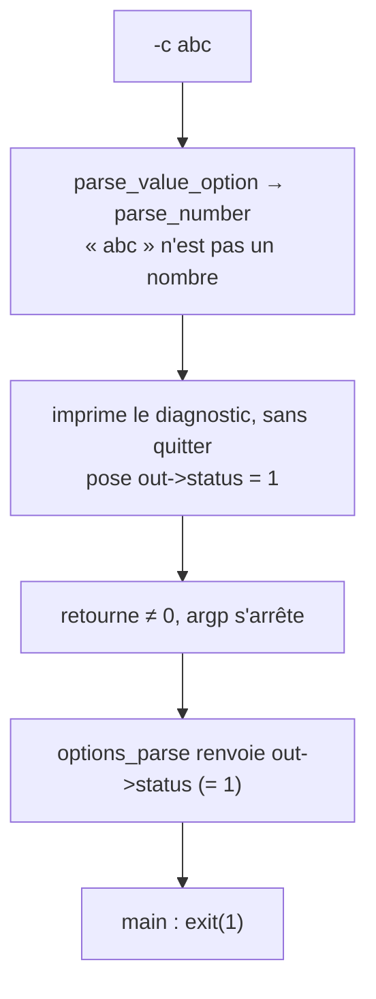

# Lire un nombre, et s'en méfier

Les pages précédentes ont montré comment `ft_ping` reconnaît les options et allume leurs drapeaux. Mais une option comme `-c 5`, `-s 100` ou `-i 0.5` porte une **valeur** — et lire une valeur est un piège bien plus profond qu'il n'y paraît. Un nombre peut être négatif, déborder, traîner des caractères parasites, ou tomber hors des limites permises. Cette page raconte comment `ft_ping` lit, valide et range ces valeurs ; et pourquoi, sur certains cas, il **refuse ce que l'étalon accepte**.

> Cet article suit le code de validation de `src/options.c` au plus près : à chaque évolution du fichier, il est mis à jour dans le même mouvement.

## Le défi : refuser sans quitter

Rappelons la promesse cardinale d'`options_parse` (article `options.h`) : **il n'appelle jamais `exit()`**. Or l'étalon, lui, valide en plein vol : pour une mauvaise valeur, inetutils exécute `error(EXIT_FAILURE, …)`, c'est-à-dire qu'il **tue le programme sur place**, au beau milieu du décodage. Cette voie nous est interdite — toute notre matrice de tests repose sur un parseur qui *revient* toujours.

Il a donc fallu un autre circuit. Quand une valeur est invalide, le code **imprime** le diagnostic, **inscrit le code de sortie voulu** dans un nouveau champ du record — `t_options.status` — puis **retourne** une valeur non nulle pour stopper argp. La fonction publique relit ce `status` et le renvoie ; `main` n'a plus qu'à en faire un `exit`.



Pourquoi un **champ** dans le record, et pas simplement la valeur de retour du callback ? Parce qu'un PoC du sprint l'avait établi : sous le drapeau `ARGP_NO_EXIT`, argp **écrase** le code que rend notre callback (il renvoie un `EINVAL` générique). Le code précis qu'on visait — `1` ou `64` — serait perdu. On le transmet donc par un canal à nous : `status`.

## Une routine pour lire un nombre

La plupart des options numériques passent par une seule fonction, `parse_number` — notre version *robuste et sans `exit`* du `ping_cvt_number` d'inetutils :

```c
static int parse_number(t_options *out, const char *prog, const char *arg, size_t maxval,
                        int allow_zero, size_t *value) {
  unsigned long n;
  char *end;

  if (arg[0] == '-') {                 /* (1) un signe « - » : refusé */
    error_value(prog, "invalid value (`%s' near `%s')", arg, arg);
    return value_error(out);
  }
  errno = 0;
  n = strtoul(arg, &end, 0);           /* base 0 : 0x.. et 0.. compris */
  if (*end != '\0') {                  /* (2) des caractères en trop */
    error_value(prog, "invalid value (`%s' near `%s')", arg, end);
    return value_error(out);
  }
  if (errno == ERANGE) {               /* (3) débordement */
    error_value(prog, "option value too big: %s", arg);
    return value_error(out);
  }
  if (n == 0 && !allow_zero) {         /* (4) zéro interdit ici */
    error_value(prog, "option value too small: %s", arg);
    return value_error(out);
  }
  if (maxval != 0 && n > maxval) {     /* (5) au-dessus du plafond */
    error_value(prog, "option value too big: %s", arg);
    return value_error(out);
  }
  *value = n;
  return 0;
}
```

`strtoul` est la fonction de la bibliothèque qui transforme une chaîne en entier non signé. Son deuxième argument, `&end`, lui fait poser un pointeur **sur le premier caractère qu'elle n'a pas su lire** : si `arg` était entièrement numérique, `*end` vaut `'\0'` ; sinon, `end` montre le caractère fautif. La **base `0`** est une commodité : elle laisse le préfixe décider — `0x10` est lu en hexadécimal (= 16), `010` en octal (= 8), tout le reste en décimal. C'est exactement le comportement de l'étalon (le piège de l'octal compris).

Les deux derniers paramètres règlent la sévérité par option : `maxval` (un plafond, `0` voulant dire « aucun ») et `allow_zero` (le zéro est-il une valeur légitime ?). Ainsi `-s` appelle `parse_number(…, 65399, 1, …)` — plafond à `65399`, zéro permis — tandis que `--ttl` demande `(…, 255, 0, …)` — plafond `255`, zéro **interdit** (un paquet de durée de vie nulle mourrait sur place).

Le petit `value_error(out)` qui clôt chaque rejet n'est qu'une commodité : il pose `out->status = 1` et retourne `1`. Le message, lui, est déjà parti — j'y reviens.

## Deux pièges que l'étalon ne voit pas

Les gardes **(1)** et **(3)** n'existent pas chez inetutils. Ce sont des **anomalies** de l'étalon que nous corrigeons sciemment.

**Le négatif.** `strtoul("-1")` ne proteste pas : elle lit le signe et **enroule** le résultat en un nombre énorme (`ULONG_MAX`). Chez inetutils, `-c -1` est donc *accepté* (count gigantesque), et `-s -1` ressort en « option value too big: **-1** » — un message qui ment, puisqu'on a saisi un nombre *trop petit*, pas trop grand. Notre garde (1) repère le `-` en tête et refuse net, avant même la conversion.

**Le débordement.** Sur un nombre trop grand, `strtoul` positionne le témoin `errno` à `ERANGE` *et* renvoie `ULONG_MAX`. Mais inetutils **ne regarde jamais `errno`** : `-c 99999999999999999999` est silencieusement ramené à `ULONG_MAX` et accepté comme si de rien n'était. Notre garde (3) lit `errno` et rejette.

Aucune de ces deux entrées n'a de sens pour un compte de paquets ou une taille. Les refuser n'est pas s'écarter de l'étalon par caprice : c'est ne pas recopier ses oublis — la doctrine du projet (le journal sert de mémoire à ces choix).

## Deux voix pour deux fautes

Toutes les erreurs ne se valent pas, et `ft_ping` le dit de deux manières distinctes :

| Nature de la faute | Code de sortie | Ligne « Try… » | Préfixe |
|---|---|---|---|
| **valeur invalide** (hors borne, mal formée, négative) | **1** | non | nom court |
| **erreur d'usage** (option inconnue, argument manquant, hôte manquant) | **64** | oui | nom court |

Le `64` est `EX_USAGE`, la valeur que `<sysexits.h>` réserve à « la ligne de commande est mal formée ». Le `1` est l'échec générique. La distinction est saine : *« tu as mal écrit la commande »* n'est pas *« la valeur que tu as donnée est hors limites »*.

C'est pourquoi le module `error` (article frère) offre **deux** portes. Les valeurs invalides empruntent `error_value`, qui imprime « *prog*: *message* » **sans** le conseil « Try… » (l'aide ne dit pas les bornes, elle ne servirait à rien ici). Les erreurs d'usage passent par `error_report`, qui ajoute la ligne « Try… ». Le code de sortie, lui, n'est pas l'affaire d'`error` : c'est l'appelant qui pose `1` ou `64` dans `status`.

Un mot sur une **incohérence de l'étalon que nous gommons** : chez inetutils, `-i abc` (un intervalle mal formé) sort en `64` avec « Try… », là où `-c abc` — *exactement la même nature de faute* — sort en `1`. La raison est un accident d'implémentation (l'interval emprunte une autre routine). Notre table n'a, elle, aucune exception : toute valeur invalide vaut `1`.

## Les cas qui sortent du moule

Quatre options refusent le moule de `parse_number`.

**`-i` (interval)** accepte des **décimales** (`-i 0.5`), donc passe par `strtod` plutôt que `strtoul`. La valeur, lue en secondes, est aussitôt convertie en **millisecondes entières** (`× 1000`) et rangée dans un `size_t` — confiner le flottant à la lecture, garder le reste du programme en arithmétique entière. Comme `strtod` honore la locale, `-i 0,5` est valide là où le système parle français, `-i 0.5` en locale C — exactement comme l'étalon, et cohérent avec l'affichage qui suivra la même convention. Le garde de signe et le garde de débordement sont conservés.

> Une restriction de l'étalon manque encore à l'appel : le **minimum de 200 ms** imposé à un utilisateur non privilégié. Elle dépend de l'identité (root ou non), une notion qui n'a sa place qu'au moment de *pinguer* — pas au décodage. Elle est donc **différée** au premier sprint réseau, et consignée comme telle dans `DEFERRED.md` (DD-011).

**`-l` (preload)** garde le libellé propre de l'étalon, « invalid preload value », et plafonne à `INT_MAX` (ce qui attrape aussi le négatif).

**`-p` (pattern)** lit un motif **hexadécimal** remplissant au plus seize octets, un ou deux chiffres par octet. Un groupe non hexadécimal est rejeté (« error in pattern near… »). Et ici une **divergence assumée** : là où inetutils tronque en silence un motif trop long, `ft_ping` le **refuse** explicitement — un programme soigné ne rogne pas l'entrée de l'utilisateur sans le dire. (Le sujet 42 range `-p` dans le bonus : nous sommes libres de faire mieux, en le documentant.)

**`-t` / `--ip-timestamp`** ne convertissent pas un nombre mais valident un **mot-clé** (`echo`/`timestamp`/`address`/`mask` ; `tsonly`/`tsaddr`), rejetant l'inconnu d'un « unsupported … type ». L'option cachée `--router`, déclarée mais pas prête, retombe sur ce même refus — comme chez inetutils.

## Garder le grand aiguilleur lisible

Toute cette validation aurait pu s'entasser dans le `switch` de `parse_opt`. Elle a été **extraite** dans une fonction à part, `parse_value_option` : `parse_opt` se contente d'y router toutes les options à argument d'un seul geste. Ce n'est pas qu'une coquetterie — c'est aussi ce qui maintient chaque `switch` sous le seuil de **complexité** que l'analyse statique du projet refuse de dépasser. Une frontière de plus, au service de la lisibilité.

## Sources

- inetutils-2.0, `ping/ping.c` (le `parse_opt` d'origine) et `ping/ping_common.c` (`ping_cvt_number`, `decode_pattern`) — le comportement de référence, anomalies comprises
- `man 3 strtoul`, `man 3 strtod` — la conversion, `endptr`, `errno`/`ERANGE`, la base 0 et la sensibilité de `strtod` à la locale
- `<sysexits.h>` — `EX_USAGE` (64)
- L'article `error.h` (« Dire l'erreur d'une seule voix ») — les deux voix du diagnostic
- `DEFERRED.md`, DD-011 — le minimum d'intervalle non-root, différé au sprint réseau
