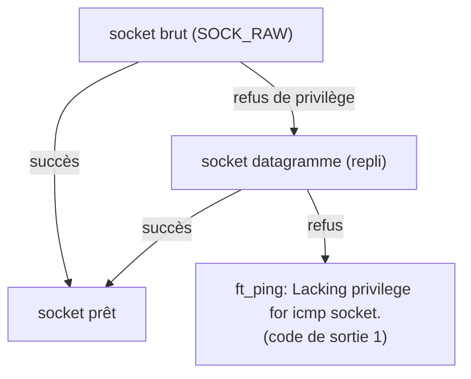

# Ouvrir une porte gardée

Jusqu'ici, mon programme lisait sa ligne de commande et traduisait un nom d'hôte
en adresse. Rien qui touche encore au réseau. Cette étape franchit le seuil : pour
envoyer un *ping*, il faut d'abord ouvrir un **socket brut** — un canal qui parle
le langage des paquets directement, sans passer par les couches habituelles. Mais
cette porte-là, le système la garde.

## Un canal que le système protège

Un programme ordinaire qui communique sur le réseau manipule des connexions de haut
niveau : « ouvre-moi une conversation avec ce serveur web ». Le système d'exploitation
se charge de la plomberie. Un *socket brut*, lui, court-circuite cette plomberie :
il permet de **forger et de lire des paquets à la main**, octet par octet. C'est
exactement ce qu'exige `ping`, dont les messages (ICMP) ne rentrent dans aucune
conversation classique.

Ce pouvoir a un revers : forger des paquets bruts, c'est aussi pouvoir en fabriquer
de trompeurs, ou espionner ceux des autres. Le noyau le réserve donc à qui détient
un privilège précis — être administrateur, ou porter une *capacité* dédiée nommée
`CAP_NET_RAW`. Mon binaire ne l'a pas par défaut : lancé tel quel, il se heurte à
un refus. On le lance donc avec `sudo`, ou on lui accorde une fois pour toutes cette
capacité (`setcap`), comme le fait le `ping` du système.

## Un repli, puis un message

Quand la porte principale est fermée, Linux offre une porte de service : un socket
*datagramme* dédié à l'ICMP, ouvrable sans privilège par certains groupes d'utilisateurs.
Mon code la tente, par fidélité à l'implémentation de référence. Mais elle n'est pas
toujours ouverte non plus — sur ma machine comme sur la moitié de mon intégration
continue, elle est condamnée. Quand les deux échouent, il reste à le dire, avec le
message exact de l'étalon :



Ce message, `Lacking privilege for icmp socket.`, je le recopie au caractère près
depuis le code source d'inetutils — seul le préfixe change, `ft_ping:` au lieu de
`ping:`, pour signer de mon propre nom.

## Séparer le geste de la décision

Une règle me guide depuis le début : isoler ce qui *agit sur le monde* de ce qui
*réfléchit*. Ouvrir un socket est un geste — un appel au système, impossible à
rejouer sans le bon privilège. En revanche, calculer l'identifiant qu'on inscrira
dans nos paquets (mon numéro de processus, ramené à seize bits) ou décider *quel
message* correspond à *quel refus* : cela, c'est du raisonnement pur, vérifiable
sans toucher au réseau.

J'ai donc réduit l'effet à une seule petite fonction — ouvrir, éventuellement
retomber sur le repli, poser une option, rendre le canal — et sorti tout le reste
en fonctions pures, testées à part. Le même partage que pour la traduction des noms,
un module plus tôt : une coquille mince qui agit, un cœur qui décide.

## Éprouver une serrure qu'on ne peut pas ouvrir

Vient alors un paradoxe qui m'a occupé un moment. Comment *tester* du code dont le
cœur — ouvrir la porte — exige un privilège que ni ma machine ni la moitié de mon
intégration continue ne possèdent ? Pire : l'autre moitié, un conteneur lancé en
administrateur, *peut* l'ouvrir. Le même test donnerait donc deux résultats opposés
selon l'endroit où il tourne.

La réponse a été de cesser de tester un *résultat* pour tester un **contrat**. Peu
importe que la porte s'ouvre ou non ; ce qui doit toujours être vrai, c'est que
l'ouverture se comporte proprement dans les deux cas :

```c
int st = -1;
int fd = net_open(&st);
if (fd < 0) {
  cr_assert(errno == EPERM || errno == EACCES);  /* refusée : un refus de privilège */
} else {
  cr_assert(st == SOCK_RAW || st == SOCK_DGRAM);  /* ouverte : un type de canal connu */
  close(fd);
}
```

Ce test passe partout : là où le privilège manque, il vérifie le refus ; là où il
est présent, il vérifie le succès. Chaque environnement en éprouve une moitié, et
aucun ne ment. Le message d'erreur, lui, se fige séparément, par un test qui compare
la sortie du programme, mot pour mot, à celle de l'étalon — mais seulement là où le
privilège fait défaut, en sautant poliment le cas quand on est administrateur.

## Le renoncement qui ne renonce à rien

Un dernier détail m'a appris à me méfier des gestes qui *paraissent* vertueux.
L'implémentation de référence, après avoir ouvert la porte, « abandonne » aussitôt
ses privilèges — un principe de prudence classique : ne rester puissant que le temps
strictement nécessaire. J'ai failli le recopier tel quel.

En y regardant de près, ce geste ne renonce à rien *dans mon cas*. Il n'efface les
pouvoirs que lorsqu'on passe d'administrateur à simple utilisateur ; or mon binaire,
lancé avec une *capacité* plutôt qu'en administrateur, n'a jamais changé d'identité —
il n'a donc rien à rendre. L'étalon lui-même, dans ce mode, ne largue jamais rien.
Reproduire l'incantation aurait donné l'illusion d'une prudence absente. J'ai préféré
ne pas la mimer, et l'écrire noir sur blanc dans mon carnet de décisions différées :
le vrai durcissement viendra si un jour il devient nécessaire, pas sous forme de
formule creuse.

## Sources

- [raw(7) — Linux manual](https://man7.org/linux/man-pages/man7/raw.7.html) — le socket brut et le privilège `CAP_NET_RAW`
- [capabilities(7) — Linux manual](https://man7.org/linux/man-pages/man7/capabilities.7.html) — `CAP_NET_RAW`, et l'effacement des capacités lors d'un changement d'identité
- [icmp(7) — Linux manual](https://man7.org/linux/man-pages/man7/icmp.7.html) — le socket datagramme ICMP non privilégié
- inetutils-2.0, `ping/libping.c` — l'ouverture, le repli et le message d'erreur repris à la lettre
