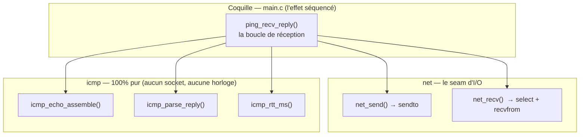
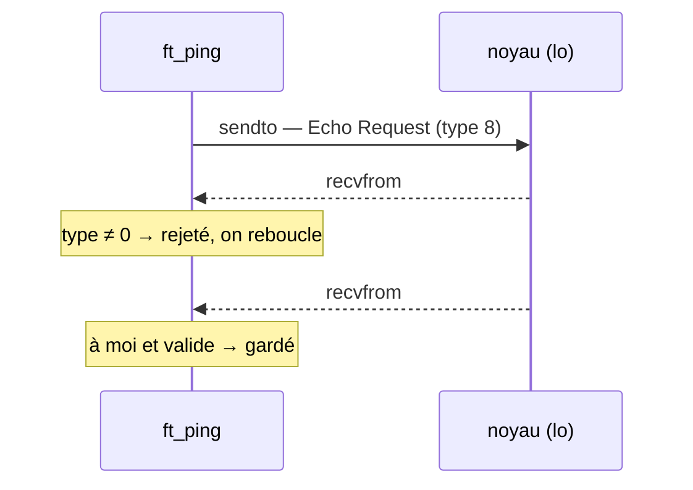

# Le miroir et l'écho

Au chapitre précédent, le paquet est devenu **valide sur le fil** : en-tête,
payload, et cette somme de contrôle qui le fait reconnaître à l'autre bout. Mais il
n'est jamais parti. Il dormait dans un tampon, parfaitement formé et parfaitement
immobile. Ce chapitre le lance enfin — et va guetter sa réponse.

C'est le cœur du projet : le premier **aller-retour** réel. `main`, jusque-là, se
contentait de résoudre un nom et d'ouvrir une prise réseau, puis rendait la main en
silence. Il va maintenant émettre une requête, attendre, et reconnaître l'écho qui
revient. Trois verbes qui cachent, chacun, un piège que je n'avais pas vu venir : un
assemblage qui menace de s'écraser lui-même, un miroir qui me renvoie ma propre
question avant la réponse, et une même réponse qui prend deux visages selon la
porte par laquelle elle entre.

Ce sprint reste **muet** : il ne montre rien à l'écran (l'affichage viendra ensuite).
Son unique parole est le **code de retour** du programme — `0` si un écho est revenu,
`1` sinon. Tout le reste se joue sous la surface.

## Le cœur et la coquille

Avant d'écrire une ligne, une question d'architecture : où mettre quoi ? Envoyer et
recevoir, ce sont des **effets** — des appels au noyau, du non-déterministe, du réseau
qui peut échouer. Assembler un paquet, en décoder un, calculer une durée, ce sont
des **fonctions pures** — des octets en entrée, des octets ou un nombre en sortie,
toujours les mêmes. Mélanger les deux, ce serait rendre le tout aussi intestable que
sa partie la plus capricieuse.

J'ai donc gardé la séparation que le projet tient depuis le début — un *functional
core* entouré d'une *imperative shell* — et je l'ai prolongée des deux côtés :



Le module `icmp` ne connaît ni socket ni horloge : on lui donne des tampons et des
horodatages, il rend des paquets et des durées. Le module `net` ne connaît que le
transport — il ignore tout de l'ICMP. Et c'est la coquille, `main`, qui orchestre :
elle seule a le droit de lire l'horloge et de parler au noyau. Cette frontière n'est
pas cosmétique ; c'est elle qui rendra, à la fin, un « réseau » entièrement
éprouvable **sans réseau**.

## Assembler sans se marcher dessus

Le paquet sortant, c'est un en-tête de 8 octets suivi d'un payload de 56 : d'abord un
horodatage — un `struct timeval` de 16 octets — puis un motif de remplissage. Le
chapitre « Écrire un paquet à la main » avait déjà une fonction, `icmp_echo_build`,
qui posait l'en-tête, **recopiait** un payload fourni, et scellait le checksum. La
tentation était de la réutiliser telle quelle : construire le payload quelque part,
puis le lui passer.

Mais « quelque part » est un problème. Le payload peut aller jusqu'à des dizaines de
milliers d'octets ; le fabriquer dans un tampon séparé pour le recopier aussitôt est
un gâchis. La solution naturelle — l'écrire **directement à sa place finale**, dans le
tampon de sortie — se heurte alors à `icmp_echo_build`, qui voudrait le recopier sur
lui-même. Un `memcpy(dst, src, n)` où `dst == src` est un **comportement indéfini** en
C : la norme interdit le recouvrement, même identique.

J'ai donc scindé l'ancienne fonction. J'en ai extrait le geste final — poser
l'en-tête et le checksum sur un payload **déjà en place** — dans une fonction interne
partagée :

```c
/* Le payload doit déjà être dans buf ; on pose l'en-tête (checksum à 0)
   puis on scelle le checksum sur l'ensemble. */
static void icmp_echo_finalize(unsigned char *buf, uint16_t ident, uint16_t seq,
                               size_t paylen) {
  t_icmp_echo hdr = {.type = ICMP_ECHO, .code = 0, .checksum = 0,
                     .id = htons(ident), .seq = htons(seq)};
  memcpy(buf, &hdr, sizeof hdr);
  uint16_t cksum = htons(checksum(buf, ICMP_ECHO_HDRLEN + paylen));
  memcpy(buf + offsetof(t_icmp_echo, checksum), &cksum, sizeof cksum);
}
```

`icmp_echo_build` garde exactement son comportement (il copie le payload fourni, puis
appelle `finalize`) — ses vecteurs de test du chapitre précédent passent sans y
toucher. Et la nouvelle fonction, `icmp_echo_assemble`, écrit son payload **in situ**
avant de sceller :

```c
unsigned char *payload = buf + ICMP_ECHO_HDRLEN;
size_t off = 0;
if (datalen >= sizeof(struct timeval)) {
  memcpy(payload, tsend, sizeof *tsend);   /* l'horodatage, à l'offset 0 */
  off = sizeof *tsend;
}
for (size_t i = off; i < datalen; i++) {
  payload[i] = (unsigned char)(i - off);   /* le motif, redémarré à 0 */
}
icmp_echo_finalize(buf, ident, seq, datalen);
```

Ce `i - off` est un détail hérité de l'original d'inetutils : le motif de remplissage
**recommence à `0x00`** juste après l'horodatage, au lieu de continuer la
numérotation. Une bizarrerie sans conséquence, mais que je reproduis pour rester
byte-à-byte fidèle. Deux fonctions, un seul endroit qui connaît la forme de l'en-tête
et le calcul du checksum : pas de duplication, et surtout pas un octet recopié sur
lui-même.

## Le temps glissé dans le paquet

Comment mesure-t-on un aller-retour ? La réponse d'inetutils est d'une élégance que
j'ai mis un moment à apprécier : on n'enregistre **rien** côté client. L'heure de
départ est **écrite dans le payload** — ce sont les 16 premiers octets qu'on vient de
poser. Le serveur, en renvoyant l'écho, nous **rend notre propre horodatage**. À la
réception, il suffit de le relire et de le soustraire à l'heure courante :

```
RTT = maintenant − (heure lue dans la réponse)
```

Aucune table à tenir, aucun état à faire correspondre entre l'envoi et le retour :
le paquet transporte lui-même sa date de naissance. La soustraction, elle, reproduit
le `tvsub` de l'étalon — une différence de deux `timeval` avec l'emprunt à la main sur
les microsecondes, parce qu'un champ `tv_usec` ne peut pas être négatif :

```c
out.tv_usec -= sent->tv_usec;
if (out.tv_usec < 0) {       /* pas assez de µs : on emprunte une seconde */
  out.tv_sec -= 1;
  out.tv_usec += 1000000;
}
out.tv_sec -= sent->tv_sec;
```

Le résultat se convertit en millisecondes (`tv_sec × 1000 + tv_usec / 1000`), la durée
qu'affichent tous les `ping` du monde. Un choix se cache là : `gettimeofday` lit
l'**horloge murale**, celle qu'un ajustement NTP peut faire sauter en pleine mesure —
`CLOCK_MONOTONIC` serait plus rigoureux. Mais l'horloge murale est ce qu'inetutils
inscrit dans le payload, et changer d'horloge changerait les octets sur le fil. Sur
un projet dont l'objet *est* la fidélité, j'ai gardé `gettimeofday` et noté
l'amélioration possible plutôt que de rompre le format. La justesse cède, ici, à la
conformité — un arbitrage assumé.

## Attendre, mais pas indéfiniment

L'émission est facile : `sendto`, un datagramme, c'est atomique. La réception l'est
moins, car il faut se prémunir du silence — une réponse peut se perdre, et un
programme qui attend sans borne se fige. Deux outils bornent l'attente : l'option
`SO_RCVTIMEO`, qui rend un `recvfrom` bloquant-limité, et `select`, qui surveille le
descripteur avec un délai. J'ai choisi `select` :

```c
ssize_t net_recv(int fd, unsigned char *buf, size_t bufsz, int timeout_ms) {
  fd_set rset;
  struct timeval tv = {.tv_sec = timeout_ms / 1000,
                       .tv_usec = (long)(timeout_ms % 1000) * 1000};
  FD_ZERO(&rset);
  FD_SET(fd, &rset);
  int r = select(fd + 1, &rset, NULL, NULL, &tv);
  if (r <= 0) {
    return r;   /* 0 = délai écoulé, -1 = erreur */
  }
  return recvfrom(fd, buf, bufsz, 0, NULL, NULL);
}
```

`select` m'a semblé le bon choix pour deux raisons. D'abord, il ne pose aucun état
sur le socket : le délai est un argument, pas un réglage persistant. Ensuite — on le
verra à l'instant — la réception va devoir **reboucler**, et à chaque tour je veux
passer le **temps qu'il reste**, pas repartir à chaque fois pour le délai complet.
`select` prend ce temps restant naturellement ; c'est aussi lui qui, au sprint
suivant, saura surveiller plusieurs événements à la fois. `net_recv` reste par
ailleurs volontairement bête : il attend, il lit **un** datagramme, il le rend brut.
Il ne sait pas décoder — c'est le travail du cœur pur, et cette ignorance est
précisément ce qui le rendra testable sur n'importe quel socket.

## Le miroir renvoie d'abord la question

Voici le piège que je n'avais pas anticipé. J'envoie un `ping` à `127.0.0.1`, je lis
la réponse… et je tombe sur ma **propre requête**. Un `strace` le montre sans
ambiguïté : deux lectures, pas une.

```
sendto(3, ..., 64, 0, {127.0.0.1}, 16) = 64
recvfrom(3, "\x45\x00...\x08\x00...", ...) = 84   <- type 8 : MA requête, rebouclée
recvfrom(3, "\x45\x00...\x00\x00...", ...) = 84   <- type 0 : la vraie réponse
```

Sur l'interface de bouclage, le noyau me **retourne ce que j'émets** avant de me
livrer la réponse qu'il fabrique. Le premier paquet qui remonte du socket brut est
donc un `ICMP_ECHO` (type 8) — le mien —, pas un `ICMP_ECHOREPLY` (type 0). Un unique
`recvfrom` ne suffit jamais : il attrape le reflet, pas l'écho.



La réception doit donc **filtrer et insister** : lire, écarter tout ce qui n'est pas
*ma* réponse, et recommencer tant qu'il reste du temps. C'est le rôle de la seule
fonction un peu dense de la coquille, `ping_recv_reply` :

```c
static int ping_recv_reply(const t_ping *ping, int timeout_ms, t_reply *out,
                           struct timeval *trecv) {
  unsigned char buf[PING_BUF_MAX];
  struct timeval start;
  int remaining = timeout_ms;

  gettimeofday(&start, NULL);
  while (remaining > 0) {
    ssize_t n = net_recv(ping->fd, buf, sizeof buf, remaining);
    if (n > 0) {
      gettimeofday(trecv, NULL);                 /* l'heure d'arrivée, au plus tôt */
      if (icmp_parse_reply(buf, (size_t)n, ping->socktype,
                           (uint16_t)ping->ident, out) == 0) {
        return 0;                                /* notre écho : fini */
      }
    } else if (n == 0 || errno != EINTR) {
      return -1;                                 /* délai écoulé, ou vraie erreur */
    }
    struct timeval now;                          /* sinon : combien de temps reste-t-il ? */
    gettimeofday(&now, NULL);
    long elapsed = ((now.tv_sec - start.tv_sec) * 1000)
                 + ((now.tv_usec - start.tv_usec) / 1000);
    remaining = timeout_ms - (int)elapsed;
  }
  return -1;
}
```

Le paquet qui n'est pas le nôtre — notre reflet, ou le `ping` d'un autre processus —
fait simplement retomber la boucle, qui recalcule le temps restant et attend de
nouveau. C'est ici, dans la coquille, que se combinent l'effet (`net_recv`) et le
jugement pur (`icmp_parse_reply`) : `net` ne sait pas ce qu'il lit, `icmp` ne sait pas
lire un socket, et c'est leur rencontre, sous la garde du chronomètre, qui distingue
enfin l'écho du bruit.

## Deux visages d'une même réponse

Reste à répondre à la question que la boucle délègue : *ce datagramme est-il ma
réponse ?* Et là, une seconde surprise — la réponse ne se présente pas de la même
façon selon le type de socket obtenu à l'ouverture. J'ai mesuré les deux, sur le même
aller-retour :

| | **SOCK_RAW** (privilégié) | **SOCK_DGRAM** (ping socket) |
|---|---|---|
| octets rendus | **84** (20 IP + 8 + 56) | **64** (8 + 56) |
| premier octet | `0x45` — un en-tête **IP** | `0x00` — directement l'ICMP |
| identifiant | **préservé** (le mien) | **réécrit** par le noyau |
| TTL | lisible (`buf[8]`) | absent |

En socket brut, je reçois le paquet IP **entier** : à moi de sauter l'en-tête. En ping
socket, le noyau me livre l'ICMP **nu**, mais il a réécrit l'identifiant (il l'utilise
pour son propre démultiplexage) et effacé l'en-tête IP, donc le TTL. Le même écho,
deux emballages. Tout le parsing doit donc se brancher sur le type de socket :

```c
size_t off = 0;
int ttl = -1;
if (socktype == SOCK_RAW) {
  struct ip iph;
  if (len < sizeof iph) {
    return -1;
  }
  memcpy(&iph, buf, sizeof iph);
  off = (size_t)iph.ip_hl * 4;   /* longueur d'en-tête IP, jamais 20 en dur */
  ttl = iph.ip_ttl;
}
```

Deux précautions se cachent dans ces lignes. La longueur de l'en-tête IP n'est **pas**
une constante : le champ `ip_hl` la donne en mots de 32 bits, et des options peuvent
la porter de 20 à 60 octets — d'où `ip_hl * 4`, et jamais un `20` écrit à la main. Et
le filtrage par identifiant, lui, ne vaut **qu'en socket brut** :

```c
uint16_t id = ntohs(hdr.id);
if (socktype == SOCK_RAW && id != ident) {
  return -1;      /* en RAW, on reçoit tout : on filtre. En DGRAM, surtout pas. */
}
```

En socket brut, le noyau me livre *tous* les ICMP de la machine ; c'est mon
identifiant qui distingue mes réponses de celles d'un autre `ping`. En ping socket,
le noyau a **déjà** fait ce tri — et il a réécrit l'identifiant au passage. Filtrer
sur le mien y jetterait, paradoxalement, **toutes** mes réponses. La bonne réponse à
« est-ce à moi ? » dépend donc de qui, du programme ou du noyau, tient déjà le
registre. Entre les deux, un ultime rempart commun : le checksum du chapitre
précédent, re-sommé sur l'ICMP reçu, doit tomber à zéro — sinon le paquet est corrompu
et rejeté. La primitive qui scellait à l'émission valide à la réception ; une seule
fonction, aux deux bouts.

## Copier plutôt que pointer

Un dernier détail, discret et redoutable. Une fois l'en-tête IP sauté, l'horodatage
d'origine se trouve dans le payload — en socket brut, à l'offset **28** (20 octets
d'IP + 8 d'ICMP). Or `28 = 4 mod 8`, et un `struct timeval`, qui contient des entiers
longs, réclame un alignement sur **8** octets. Le lire par un simple transtypage de
pointeur —

```c
struct timeval *tp = (struct timeval *)(buf + off + 8);   /* NON */
```

— serait un accès **désaligné** : comportement indéfini, et sur certaines
architectures un *bus error* qui tue le programme net. Le compilateur du projet le
refuse d'ailleurs catégoriquement, grâce au drapeau `-Wcast-align=strict` armé depuis
le chapitre « Écrire un paquet à la main ». La parade est la même discipline que
celle du checksum : ne jamais faire pointer une structure sur un tampon d'octets, mais
**copier** les octets vers une variable locale, que le compilateur, lui, aligne
correctement :

```c
if (out->datalen >= sizeof(struct timeval)) {
  memcpy(&out->tsend, buf + off + ICMP_ECHO_HDRLEN, sizeof out->tsend);
  out->have_ts = 1;
}
```

`struct ip`, `struct icmphdr`, `struct timeval` : les trois se lisent par `memcpy`,
jamais par cast. Ce qui ressemble à une superstition est en réalité la seule façon
correcte de désérialiser un tampon réseau en C portable — le paquet arrive comme une
adresse quelconque, la structure exige la sienne, et `memcpy` est le pont entre les
deux.

## Un moteur qui se tait

Tout cela — assembler, émettre, attendre, filtrer, dater — et pas une ligne à l'écran.
Le découpage du projet réserve l'affichage conforme au chapitre suivant ; celui-ci ne
livre que le **moteur**. Comment, alors, un sprint muet prouve-t-il qu'il fonctionne ?
Par son **code de sortie**, exactement comme l'étalon : `0` si au moins un écho est
revenu, `1` sinon.

```c
if (ping_recv_reply(&ping, FT_PING_DEFAULT_LINGER * 1000, &reply, &trecv) == 0) {
  received = 1;
  if (reply.have_ts) {
    double rtt = icmp_rtt_ms(&reply.tsend, &trecv);
    (void)rtt;   /* calculé dès maintenant ; imprimé au prochain chapitre */
  }
}
...
return received ? 0 : 1;
```

Ce `(void)rtt` est un aveu tranquille : la durée est déjà juste, seul son affichage
manque. Le sprint fait le travail difficile en coulisses et laisse la parole pour
plus tard. Rien de jetable là-dedans : ce code de retour est celui qu'inetutils
renvoie déjà, donc rien à défaire quand la boucle et les statistiques arriveront.

## Éprouver un réseau sans réseau

La séparation du début paie ici son dividende. Le gros de la logique risquée — assembler,
parser les deux visages, calculer le RTT — est **pur**, donc éprouvable par des
**vecteurs**, hors ligne : je fabrique à la main une réponse RAW (en-tête IP cousu,
options comprises), une réponse DGRAM, une réponse trop courte, une au mauvais
checksum, une du mauvais type, une avec un identifiant étranger — et j'affirme, pour
chacune, ce que `icmp_parse_reply` doit en faire. Aucun privilège, aucun réseau, un
résultat identique partout.

Le transport, lui, est un effet — mais un effet **agnostique du protocole**. `net_send`
et `net_recv` ne savent rien de l'ICMP ; je les exerce donc sur un simple socket
**UDP bouclé** sur `127.0.0.1`, sans le moindre privilège : un datagramme qui retrouve
ses octets, et surtout le chemin du **délai écoulé**, où rien n'arrive et où `net_recv`
doit rendre `0`. Ne reste qu'un fil que ces deux mailles ne couvrent pas : le vrai
socket ICMP, qui exige `CAP_NET_RAW`. Un unique test de fumée s'en charge, gardé pour
la seule machine privilégiée — `ft_ping 127.0.0.1`, code de retour `0`. C'est peu, et
c'est suffisant, parce que tout le reste a déjà été prouvé sans lui.

Il y a une ironie que j'aime bien dans ce dernier point. Sur ma propre machine comme
sur l'intégration continue, les ping sockets sont fermés (`ping_group_range` vaut
`1 0`) : le chemin dégradé DGRAM ne s'ouvre jamais *en vrai*. Il n'existe, pour nous,
que sous la forme d'un vecteur de test — une réponse fabriquée, sans en-tête IP, avec
un identifiant qu'on ne filtre pas. Un morceau de code qu'on ne verra sans doute
jamais s'exécuter chez nous, mais qu'on a écrit juste, décrit juste, et prouvé juste.
Le premier ping est parti, il est revenu ; il ne lui manque plus qu'une voix.

## Sources

- [RFC 792 — Internet Control Message Protocol](https://www.rfc-editor.org/rfc/rfc792) — les types Echo (8) et Echo Reply (0)
- [sendto(2)](https://man7.org/linux/man-pages/man2/sendto.2.html) et [recvfrom(2)](https://man7.org/linux/man-pages/man2/recvfrom.2.html) — l'émission et la réception d'un datagramme
- [select(2)](https://man7.org/linux/man-pages/man2/select.2.html) — l'attente bornée sur un descripteur
- [raw(7)](https://man7.org/linux/man-pages/man7/raw.7.html) — « for receiving, the IP header is always included »
- [icmp(7)](https://man7.org/linux/man-pages/man7/icmp.7.html) — les ping sockets et `ping_group_range`
- inetutils-2.0, `ping/ping_common.c` — `tvsub` et l'horodatage glissé dans le payload
