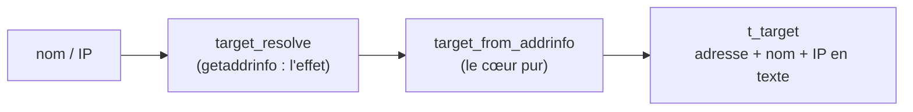

# Traduire un nom, et s'arrêter là

Pour viser une cible, il faut d'abord savoir où elle est. `localhost`, `example.com`, `8.8.8.8` : autant de façons de désigner une machine, mais aucune n'est encore une **adresse** que la pile réseau peut atteindre. Même « 127.0.0.1 » n'est qu'une suite de caractères tant qu'on ne l'a pas convertie en quatre octets. Ce sprint ajoute le module `target`, qui traduit le nom en adresse — et, plus discrètement, apprend à **ne pas en faire trop**.

## Une porte unique, une liste en retour

La libC offre une fonction faite pour ça, **`getaddrinfo`**, et c'est par elle que passe aussi l'étalon — l'utiliser, c'est hériter de son comportement. Sa force est d'avaler indifféremment un **nom** à résoudre par DNS ou une **IP littérale** déjà toute prête, et de rendre, dans tous les cas, une **liste chaînée** de `struct addrinfo` : chaque maillon décrit une adresse atteignable, déjà mise en forme pour les appels réseau.

Pourquoi une *liste* ? Parce qu'un nom peut pointer vers plusieurs adresses (plusieurs enregistrements A, de l'IPv4 et de l'IPv6…). `ping` n'en vise qu'une : on prendra la **première**, sans chercher plus loin.

## Cadrer la demande : les *hints*

On ne veut pas tout. À `getaddrinfo`, on tend un gabarit — un `struct addrinfo` baptisé `hints` — qui filtre les réponses :

```c
struct addrinfo hints;
struct addrinfo *res = NULL;

memset(&hints, 0, sizeof(hints));
hints.ai_family = AF_INET;     /* IPv4 only -> sockaddr_in throughout */
hints.ai_flags = AI_CANONNAME; /* canonical name for the PING header */
if (getaddrinfo(host, NULL, &hints, &res) != 0) {
  return 1; /* every failure is flattened into "unknown host" */
}
target_from_addrinfo(host, res, out);
freeaddrinfo(res); /* once, never on failure */
return 0;
```

On commence par **tout mettre à zéro** (`memset`), puis on ne pose que deux champs. **`ai_family = AF_INET`** restreint à l'IPv4 — c'est ce qu'impose le sujet, et cela garantit que toute adresse rendue sera un `sockaddr_in`. **`ai_flags = AI_CANONNAME`** demande à `getaddrinfo` de remplir au passage le **nom canonique** de l'hôte (j'y reviens). Le deuxième argument, le « service », vaut `NULL` : un ping ICMP n'a pas de port.

Deux pièges de cette API méritent un mot. D'abord, `getaddrinfo` **ne suit pas la convention `errno`** : elle rend `0` en succès, ou un code `EAI_*` non nul en échec. On ne le décortique pas — tout échec devient le même `unknown host` (voir plus bas) —, d'où le simple `return 1`. Ensuite, la liste qu'elle alloue **nous appartient** : il faut la rendre avec **`freeaddrinfo`**, exactement une fois, et **jamais** sur un échec (où `res` est indéterminé). C'est `valgrind`, dans la cible `memcheck`, qui veille à ce que rien ne fuie.

## Extraire ce qu'on garde

La liste est éphémère : `freeaddrinfo` la détruit dès la ligne suivante. Avant cela, on en recopie trois choses dans notre structure, et c'est tout le rôle de `target_from_addrinfo` :

```c
void target_from_addrinfo(const char *host, const struct addrinfo *ai, t_target *out) {
  memcpy(&out->addr, ai->ai_addr, sizeof(out->addr));
  (void)snprintf(out->name, sizeof(out->name), "%s",
                 ai->ai_canonname ? ai->ai_canonname : host);
  (void)inet_ntop(AF_INET, &out->addr.sin_addr, out->presentation,
                  (socklen_t)sizeof(out->presentation));
}
```

**`memcpy` — l'adresse binaire.** `ai->ai_addr` est un `struct sockaddr *`, un pointeur d'adresse « générique ». Comme on a résolu en `AF_INET`, il pointe en réalité vers un `sockaddr_in`. On le recopie chez nous. Pourquoi `memcpy` plutôt que `*(struct sockaddr_in*)ai->ai_addr` ? Parce qu'un transtypage direct **suppose un alignement** que rien ne garantit sur un `sockaddr` générique ; `memcpy` copie octet par octet, sans cette hypothèse — l'idiome sûr.

**`snprintf` — le nom.** On range dans `out->name` soit le nom canonique, soit, s'il manque, le `host` brut (l'opérateur ternaire). Pourquoi `snprintf` et non `strcpy` ou `strncpy` ? `strcpy` ne **borne** rien (débordement possible) ; `strncpy` borne mais ne **termine pas** toujours par `\0`. `snprintf` fait les deux. Le `(void)` annonce qu'on ignore sciemment sa valeur de retour — ce que réclame notre politique `clang-tidy`.

**`inet_ntop` — l'IP en texte.** *« network to presentation »* : elle convertit l'adresse binaire (`&out->addr.sin_addr`, quatre octets) en sa forme lisible, `"127.0.0.1"`, rangée dans `out->presentation`. Son inverse est `inet_pton` (*presentation to network*). On lui passe la taille du buffer, transtypée en `socklen_t` pour éteindre un avertissement de conversion.

## La cible, en valeur

Ces trois champs vivent dans un type **POD** — *plain old data*, sans mémoire possédée :

```c
typedef struct s_target {
  char               name[FT_PING_NAMELEN];         /* canonical name (host as fallback) */
  char               presentation[INET_ADDRSTRLEN]; /* dotted-quad of the address */
  struct sockaddr_in addr;                          /* the resolved IPv4 address */
} t_target;
```

Le choix qui compte est que le nom est **copié dans un tableau inline** (`FT_PING_NAMELEN`, soit `NI_MAXHOST`, la taille de référence d'un nom d'hôte), et non gardé comme pointeur. Le canonique vient de l'`addrinfo`, qu'on libère aussitôt : un pointeur dessus pendouillerait dans le vide. En copiant, `t_target` ne possède aucune allocation, se compare par valeur, et se teste comme notre `t_options` — exactement ce qu'on veut.

## Éprouver le cœur sans réseau

Résoudre, c'est interroger le DNS : un **effet de bord** qu'on bannit des tests unitaires (lents, dépendants du réseau, non déterministes). La parade tient en une frontière : `target_resolve` concentre le **seul** appel réseau ; tout le reste — choisir l'adresse, formater l'en-tête, traduire un échec — est **pur** et reçoit une `addrinfo` déjà obtenue.



L'astuce qui rend ce cœur réellement testable : appeler `getaddrinfo` sur une **IP littérale** avec le drapeau **`AI_NUMERICHOST`** fabrique une vraie `addrinfo` **sans la moindre requête réseau**. Nos tests s'en servent pour éprouver la vraie logique — le bon octet d'adresse, la présentation `"127.0.0.1"`, l'en-tête au format exact — sur de vraies structures, hors-ligne et sans faux-semblant.

## Le nom qu'on affiche

L'en-tête d'un ping — `PING localhost (127.0.0.1): 56 data bytes` — montre un nom. Lequel, exactement ? J'ai d'abord cru : celui qu'on a tapé. C'était trop vite dit. L'étalon affiche le **nom canonique** rendu par la résolution (`ai_canonname`), pas l'argument brut. La preuve tient en deux essais : `LOCALHOST` devient `localhost`, et `localhost.` (avec le point final) devient `localhost` aussi — une simple recopie de l'argument ne ferait ni l'une ni l'autre. D'où le `ai->ai_canonname` de tout à l'heure, avec le `host` brut en seul recours si le canonique manque. On reproduit fidèlement : le nom affiché est le canonique.

## Une seule voix pour l'échec

Que faire d'un nom introuvable, ou d'une IP absurde comme `300.1.2.3` ? L'étalon ne s'embarrasse d'aucune nuance : **tout** échec de résolution donne le même message, `unknown host`, et le même code, `1`. On aplatit pareil. Le câblage, dans `main`, tient en une boucle sur les opérandes :

```c
for (size_t i = 0; i < options.n_hosts; i++) {
  if (target_resolve(options.hosts[i], &ping.target) != 0) {
    error_value(prog, "unknown host");
    exit(EXIT_FAILURE);
  }
}
```

Le message réutilise `error_value`, notre voix d'erreur « sans le *Try …* » déjà décrite pour le module `error`. La boucle prépare le terrain multi-hôtes (l'étalon les pingue l'un après l'autre) ; pour l'instant, le premier hôte introuvable arrête tout, comme lui. Un hôte qui **résout**, lui, est simplement stocké — l'émission viendra avec le socket, au sprint suivant.

## Savoir s'arrêter

Restait une tentation : et les noms à accents, `münchen.de` et consorts ? Les gérer demande de convertir l'Unicode en ASCII — le « Punycode » — avant de résoudre. Or le drapeau qui ferait cela dans `getaddrinfo`, `AI_IDN`, n'existe que sous `_GNU_SOURCE` — une macro qui, en prime, **rebranche** des fonctions comme `strerror_r` sur leur variante GNU, un nid à bugs silencieux. La vraie voie serait une bibliothèque dédiée, `libidn2` ; mais le sujet n'autorise que la libC.

Le verdict est venu d'une **vérification**, pas d'un principe : notre étalon de référence n'est lié à *aucune* bibliothèque IDN (`ldd` le confirme) — il ne traduit donc pas ces noms non plus. Ne rien faire n'est pas une lacune ; c'est **exactement** son comportement. La conformité, parfois, c'est savoir s'arrêter. Même retenue pour la résolution inverse (IP → nom) des réponses : le sujet l'interdit explicitement, on s'en passe.

Une dernière asymétrie, notée pour plus tard : l'étalon ouvre son socket brut **avant** de résoudre (par moindre privilège — acquérir la ressource privilégiée, désescalader, puis travailler). Sans socket à ce stade, on résout d'abord, et un hôte inconnu produit `unknown host` même sans privilège, là où l'étalon dirait d'abord *« Lacking privilege »*. La divergence est consignée ; on la tranchera quand le socket brut entrera en scène.

## Sources

- `man getaddrinfo(3)` / `getnameinfo(3)` — la résolution, `struct addrinfo`, les `ai_flags` (`AI_CANONNAME`, `AI_NUMERICHOST`), les codes `EAI_*`, la liste à libérer par `freeaddrinfo`
- `man inet_ntop(3)` — *network to presentation*, `INET_ADDRSTRLEN`, le couple avec `inet_pton`
- inetutils-2.0, `ping/libping.c` (`ping_set_dest`) et `ping/ping_echo.c` — l'ordre réel des opérations et la ligne d'en-tête `PING …`
- La doc GNU de `getaddrinfo` sur `AI_IDN`/`_GNU_SOURCE`, et `libidn2` — la voie écartée pour les noms internationalisés
