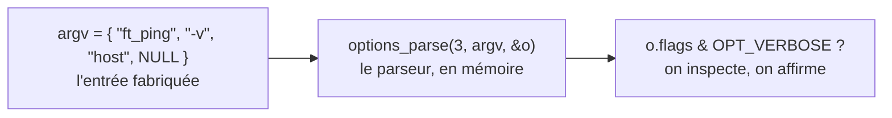

# Le parseur passé au crible

Les pages précédentes ont décrit un parseur : une table, un aiguilleur, un contrat. Mais un parseur, ça se trompe — un bit mal posé, un opérande oublié, un mauvais code de retour. Comment s'assurer qu'il fait, sur chaque ligne de commande imaginable, exactement ce qu'il doit ? En l'interrogeant, méthodiquement. `tests/unit/test_options.c` est cet interrogatoire : **93 cas** qui soumettent au parseur des lignes de commande fabriquées et vérifient le résultat — le tout en mémoire, en une fraction de seconde, sans toucher au réseau.

> Cet article suit `tests/unit/test_options.c` au plus près : à chaque évolution du fichier, il est mis à jour dans le même mouvement.

## Tester en mémoire — et pourquoi c'est possible

L'idée tient en trois lignes : on fabrique un `argv`, on le donne à `options_parse`, on regarde le `t_options` qui en sort. Aucun socket, aucun privilège, aucune attente réseau. Si c'est faisable, ce n'est pas un hasard, mais le **dividende** des choix décrits plus tôt :

- `options_parse` ne fait qu'**analyser** et produit un `t_options` *pur* (article `ft_ping.h`) — donc le résultat tient tout entier dans une variable qu'on peut inspecter ;
- elle **ne quitte jamais** par `exit()` (article `options.h`) — donc une ligne de commande invalide ne fait pas tomber le test, elle renvoie un code qu'on examine ;
- elle est **réentrante** — donc on peut l'appeler des dizaines de fois d'affilée, chaque cas repartant propre.

Un détail de construction mérite d'être signalé, car il intrigue : *comment* teste-t-on `options_parse` sans lancer le programme ? Le binaire de test ne compile pas `main.c`. Il assemble les **modules** (`options.c`, `error.c`) avec les fichiers de test, et c'est **Criterion qui fournit son propre `main()`** — le lanceur qui découvre et exécute les cas. Côté `Makefile`, c'est le sens de `LIB_SRC := filter-out main.c` : on lie tout *sauf* notre point d'entrée, pour ne garder que la logique à éprouver.

## Criterion, en bref

[Criterion](https://github.com/Snaipe/Criterion) est le cadre de test employé. On y déclare un cas avec la macro `Test(suite, nom)` :

```c
Test(flags_short, verbose) {
  /* ... le corps du test ... */
}
```

`suite` regroupe les cas par thème (`flags_short`, `errors`, `reentrance`…), `nom` identifie le cas. À la compilation, Criterion recense tous ces `Test(...)` et, à l'exécution, les lance un par un.

Sa particularité décisive : **chaque test tourne dans son propre processus** (Criterion fait un *fork* avant chaque cas). Trois bénéfices. Un cas qui planterait pour de bon — un déréférencement nul, un *segfault* — n'abat pas les 58 autres : il est compté comme échoué, et le bal continue. Chaque cas démarre dans un état parfaitement neuf. Et, surtout pour nous, chaque cas peut rediriger ses propres flux sans déranger les voisins (j'y viens).

## L'anatomie d'un cas

Tous les cas suivent le même squelette en trois temps : **fabriquer** l'entrée, **appeler** le parseur, **affirmer** le résultat.

```c
Test(flags_short, verbose) {
  char *argv[] = {"ft_ping", "-v", "host", NULL};   /* 1. l'entrée fabriquée */
  t_options o;

  cr_assert(eq(int, options_parse(3, argv, &o), 0)); /* 2. l'appel, code 0 attendu */
  cr_assert(eq(int, (int)(o.flags & OPT_VERBOSE), OPT_VERBOSE)); /* 3. l'inspection */
}
```



Un point appelle une explication, car il a l'air imprudent : `argv` est un tableau **local** de **chaînes littérales**. Ne risque-t-on pas un plantage, argp tentant de modifier des littéraux (que le compilateur place en lecture seule) ? Non — et c'est noté en tête du fichier. Argp réordonne les **pointeurs** du tableau (qui, lui, est local, donc modifiable), jamais le **contenu** des chaînes : il ne fait que les *lire*. Les littéraux sont donc parfaitement sûrs ici. Le premier élément, `"ft_ping"`, n'est pas décoratif : argp saute toujours `argv[0]` (le nom du programme), comme dans un vrai lancement.

## Des assertions qui connaissent les types

`cr_assert(...)` échoue le test si son argument est faux. Mais on l'emploie presque toujours avec un *matcher* typé, `eq(type, obtenu, attendu)`, de l'API moderne de Criterion. Le premier paramètre est une étiquette de type, et elle doit correspondre à ce qu'on compare, sous peine d'avertissement du compilateur :

- `eq(int, …)` pour les entiers et les énumérations (`o.action`, `o.type`) ;
- `eq(sz, …)` pour les `size_t` (`o.count`, `o.n_hosts`) ;
- `eq(dbl, …)` pour le `double` (`o.interval`) ;
- `eq(str, …)` pour comparer deux chaînes par leur contenu (`o.hosts[0]`).

Un détail revient souvent et mérite un mot : `(int)(o.flags & OPT_VERBOSE)`. Pourquoi ce transtypage ? `flags` est un `unsigned int` ; le matcher `eq(int, …)` attend des `int`. Comparer un signé et un non-signé déclencherait un avertissement (et notre politique traite les avertissements en erreurs). On caste donc explicitement vers `int` — sans danger, les masques `OPT_*` étant de petites valeurs. On vérifie que `o.flags & OPT_VERBOSE` vaut `OPT_VERBOSE` (le bit est posé), pas `1` : c'est la subtilité du champ de bits vue dans l'article `options.h`.

## Capturer les flux

Certains cas poussent le parseur dans ses retranchements : hôte manquant, option inconnue, ou `--help`. Le programme **écrit** alors — un diagnostic sur `stderr`, l'aide sur `stdout`. Si on les laissait passer, le rapport de test serait noyé sous ces sorties. On les **capture** donc, grâce à une petite fonction d'initialisation :

```c
static void redirect_all(void) {
  cr_redirect_stdout();
  cr_redirect_stderr();
}

Test(errors, no_argument_at_all, .init = redirect_all) {
  char *argv[] = {"ft_ping", NULL};
  t_options o;
  cr_assert(eq(int, options_parse(1, argv, &o), 64));
}
```

Le `.init = redirect_all` attache cette fonction au cas : Criterion l'exécute *avant* le test, dans le processus dédié du cas, et détourne les deux flux vers des tampons que rien n'affiche. (C'est ici que l'isolation par *fork* paie : la redirection est propre à ce cas.) Noter ce que ce test affirme, et ce qu'il n'affirme pas : il vérifie le **code de retour** — `64`, soit `EX_USAGE`, pour un hôte manquant — mais **pas** le texte exact du message d'erreur. La conformité à l'octet de ces messages relève d'une autre suite, en boîte noire, qui compare la sortie réelle à celle de l'étalon ; ici, on capture seulement pour ne pas polluer.

## La matrice

L'exhaustivité est l'objectif : chaque option, chaque forme, chaque cas limite. Les 93 cas se répartissent en quinze suites.

| Suite | Cas | Ce qu'elle éprouve |
|---|---:|---|
| `defaults` | 1 | tous les champs après un simple `host` (les valeurs héritées d'inetutils) |
| `flags_short` | 7 | chaque bascule en forme courte (`-v`, `-q`, `-n`, `-d`, `-r`, `-R`, `-f`) |
| `flags_long` | 7 | les mêmes en forme longue (`--verbose`…) |
| `flags_combined` | 3 | le groupage `-dnv`, l'idempotence de `-vvv`, les drapeaux séparés |
| `types` | 7 | `echo` / `timestamp` / `address` / `mask`, le défaut, et le « dernier gagne » |
| `actions` | 6 | `--help` / `--usage` / `--version` (court et long), et `host` → `ACT_PING` |
| `operands` | 4 | un hôte, trois hôtes, et l'ordre relatif préservé malgré la permutation d'argp |
| `errors` | 6 | le code `64` (hôte manquant, option inconnue) ; et `--help`/`--version` *sans* hôte, qui restent valides |
| `value_stored` | 17 | chaque option à argument lue et **rangée** (count, taille, interval en ms, tos, ttl, types, ip-timestamp, motif…) |
| `value_forms` | 4 | les graphies de l'argument : collée (`-c5`), `=` (`--count=5`), hexadécimale (`0x10`), octale (`010`) |
| `value_bounds` | 10 | juste sous / à / au-dessus de chaque limite (`-s` 65399 vs 65400, `--ttl` 0 vs 1 vs 256…) |
| `value_errors` | 14 | les valeurs refusées : non-numérique, négatif, débordement, motif non-hexa ou trop long, type inconnu… |
| `value_codes` | 3 | l'asymétrie : une valeur invalide sort en **1**, une erreur d'usage en **64** |
| `separator` | 2 | le `--` qui transforme un `-v` en simple opérande |
| `reentrance` | 2 | un second `options_parse` sur le même objet efface bien le premier |

Quelques cas sont plus parlants que d'autres. `defaults` vérifie d'un coup les quatorze champs du record — la photo de référence d'un parsing « vierge ». `types` confirme que `--address --echo` donne bien `echo` (le dernier l'emporte). `reentrance` appelle le parseur deux fois sur le *même* `t_options` et exige que la seconde analyse ait tout remis à zéro — la garantie sans laquelle enchaîner les cas serait un piège.

## Ce qu'on ne teste pas (encore)

Un silence demeure, volontaire : le **texte exact** des messages d'erreur et d'aide. Ces tests vérifient le **code** de sortie (1 ou 64) et l'**effet** sur le record (la valeur rangée, le drapeau posé), mais pas le libellé à l'octet (« option value too big: 65400 », « error in pattern near… »). Cette conformité au caractère près relève d'une suite en **boîte noire** (l'article « [Au pied de la lettre](conformance.md) »), qui confronte la sortie réelle de `ft_ping` à celle de l'étalon — un outillage mieux taillé pour cela. La batterie présente couvre la *logique* du décodage et de la validation ; la boîte noire en est le complément.

## Sources

- [Criterion](https://github.com/Snaipe/Criterion) — le cadre de test : macro `Test`, matchers `eq(...)`, redirections `cr_redirect_*`, isolation des cas par processus
- Les articles `ft_ping.h` (« La carte avant le territoire ») et `options.h` (« Des interrupteurs et une promesse ») — l'architecture qui rend ces tests possibles (record pur, fonction sans `exit`, réentrance)
- Le `Makefile` du projet — `LIB_SRC := filter-out main.c`, qui lie les modules sans le point d'entrée pour laisser Criterion fournir le sien
